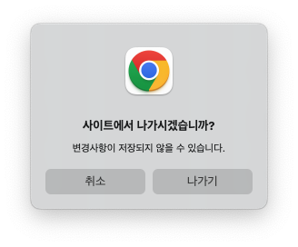
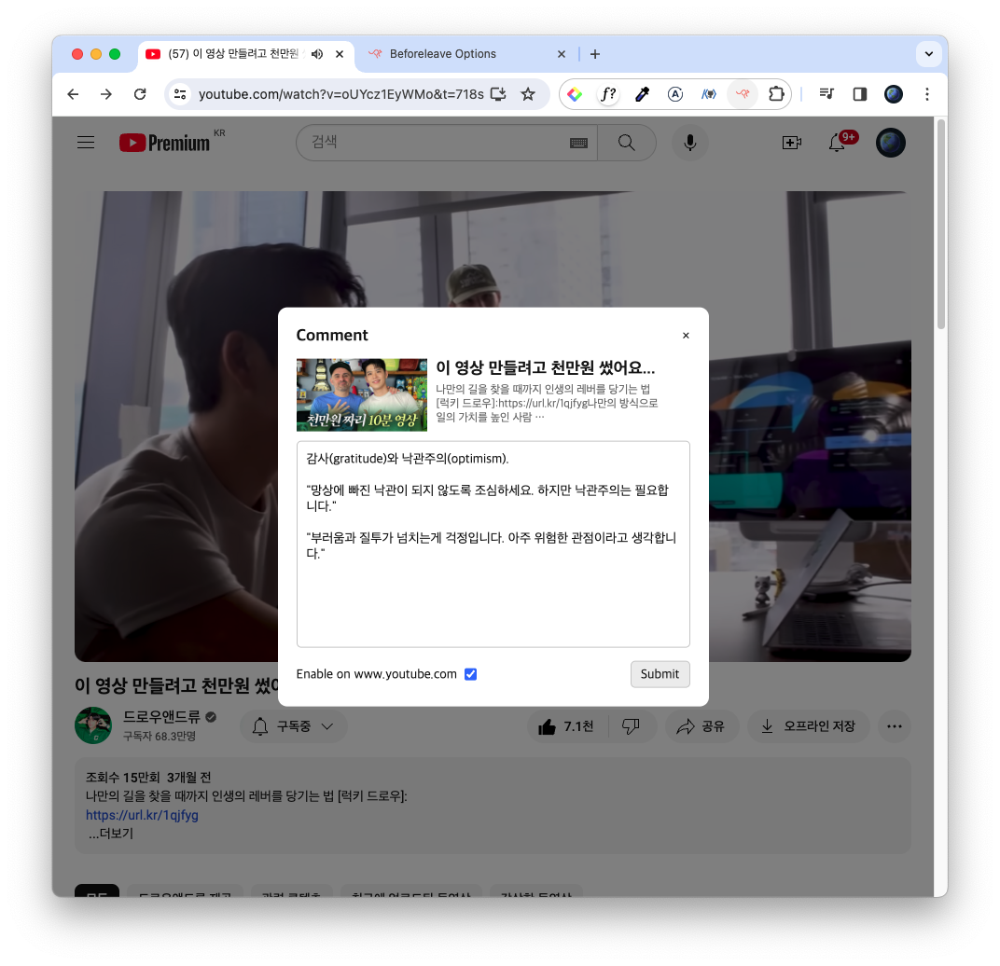
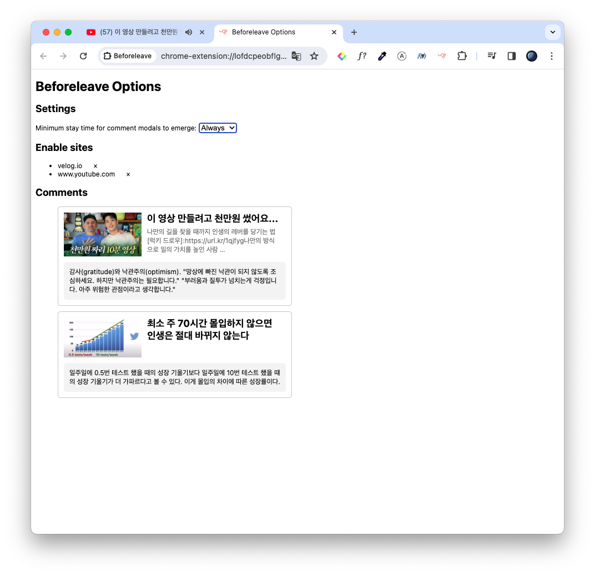
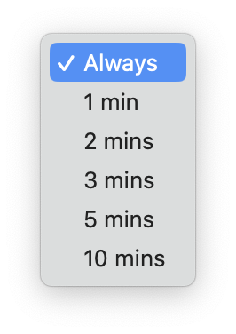

  
  <h1>Beforeleave</h1>
  
Note down your thoughts before you leave the page 📝

  

## Introduction

Deterioration of concentration due to information overload is a chronic disease in modern society. People often forget what content is just a few minutes after seeing good content on the Internet. However, it is difficult to keep a note in front of you and make a record of the content one by one you saw.

**This extension will display a dialog that users can comment on when they try to leave the page.** However, the dialog will only automatically pop up on the page that the user has allowed beforehand, and the dialog will not pop up until it stays for more than a predetermined amount of time.

## Tech Stack

- HTML + CSS + JavaScript
- Chrome Sync Storage

## Screenshots

## It will be updated...

- [Feature] Google OAuth login
- [Feature] View others' comments per page
- [Design] Better UI & UX
- [Refactor] Change to use React
